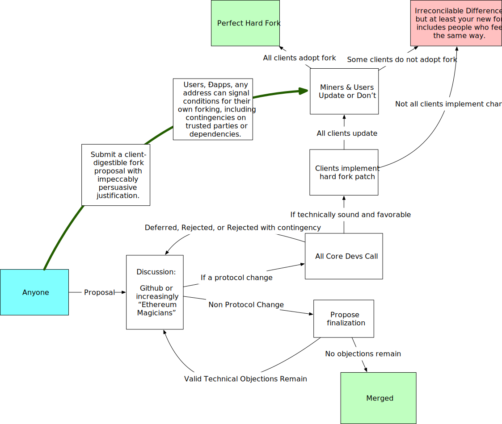

# EIP Process Flow Chart

A flow chart representing the current governance process of the Ethereum blockchain, as best as I have been able to document it.

## Contributing

The `.graffle` file is made with [OmniGraffle](https://www.omnigroup.com/omnigraffle), although the `.svg` can be edited with any svg editing software.

I may be willing to abandon the .graffle in the future, but for now, I update the graffle first, and then re-generate the svg from it.

